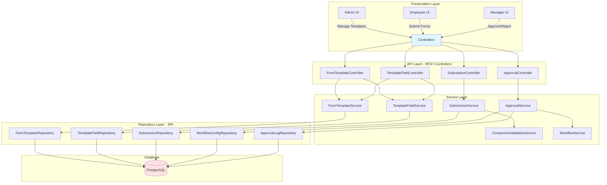
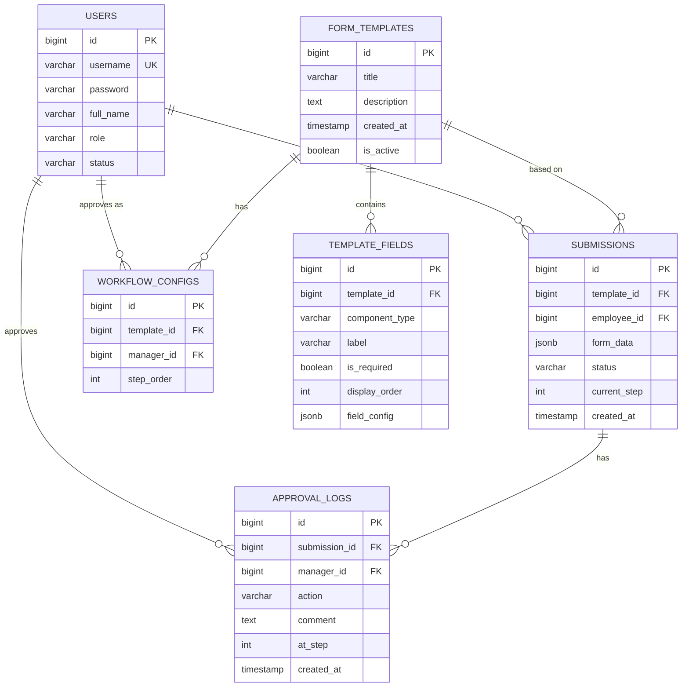
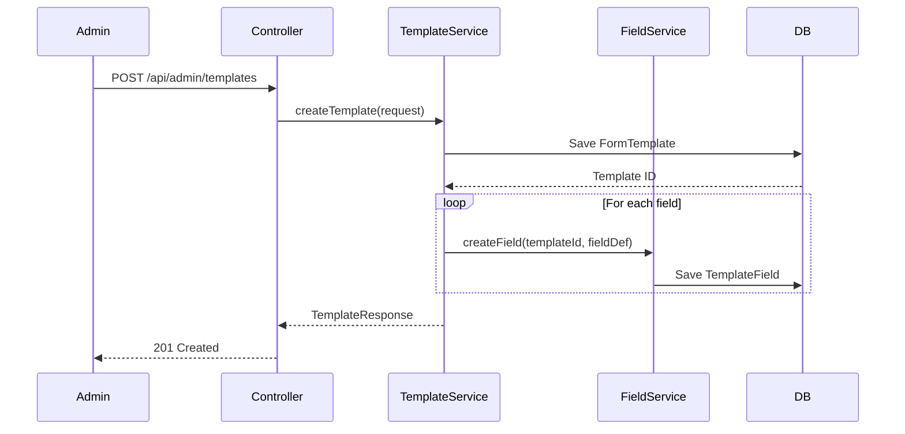
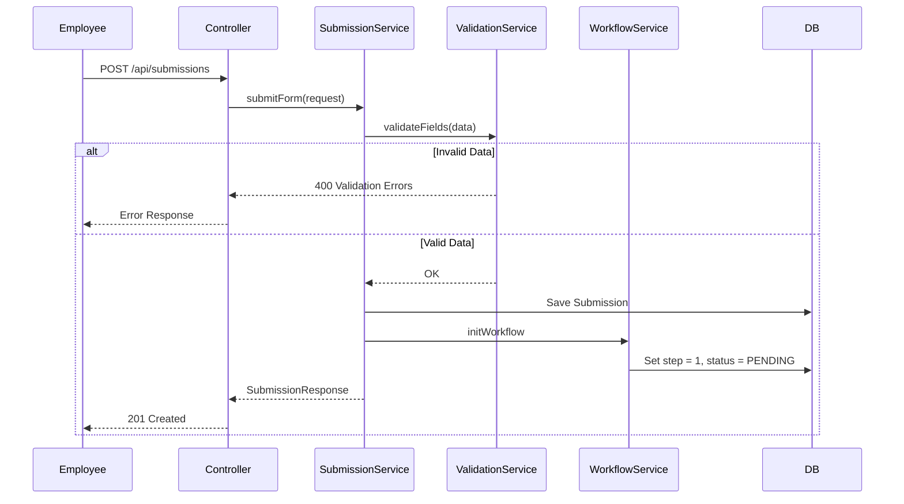
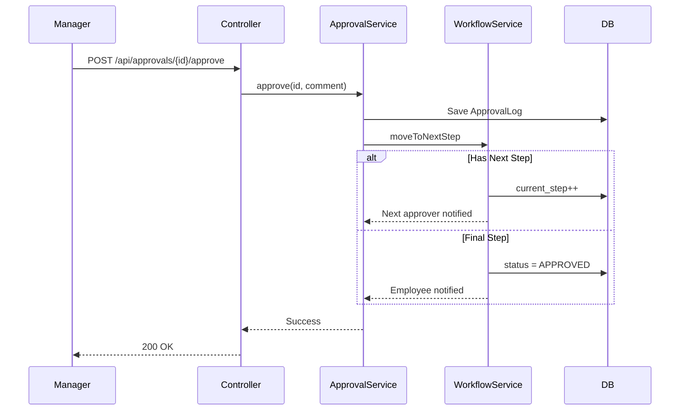
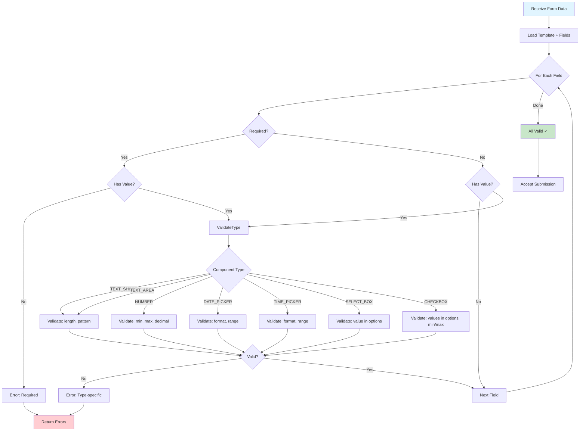

# Architecture Overview - Dynamic Form System

## System Architecture



## Component Types

Hệ thống hỗ trợ **7 loại component**:

1. **TEXT_SHORT** - Text input ngắn
2. **TEXT_AREA** - Textarea nhiều dòng
3. **NUMBER** - Input số
4. **DATE_PICKER** - Chọn ngày
5. **TIME_PICKER** - Chọn giờ
6. **SELECT_BOX** - Dropdown chọn 1 giá trị
7. **CHECKBOX** - Checkbox chọn nhiều giá trị

## Database Schema



## Data Flow: Admin Creates Template



## Data Flow: Employee Submits Form



## Data Flow: Manager Approval



## Component Validation Flow



## REST API Endpoints

### Admin - Template Management

| Method | Endpoint | Description | Auth |
|--------|----------|-------------|------|
| POST | `/api/admin/templates` | Create template | ADMIN |
| PUT | `/api/admin/templates/{id}` | Update template | ADMIN |
| GET | `/api/admin/templates` | List all templates | ADMIN |
| GET | `/api/admin/templates/{id}` | Get template | ADMIN |
| DELETE | `/api/admin/templates/{id}` | Deactivate | ADMIN |

### Admin - Field Management

| Method | Endpoint | Description | Auth |
|--------|----------|-------------|------|
| POST | `/api/admin/templates/{id}/fields` | Add field | ADMIN |
| PUT | `/api/admin/templates/fields/{id}` | Update field | ADMIN |
| DELETE | `/api/admin/templates/fields/{id}` | Delete field | ADMIN |
| PUT | `/api/admin/templates/{id}/fields/reorder` | Reorder fields | ADMIN |

### Employee - Submissions

| Method | Endpoint | Description | Auth |
|--------|----------|-------------|------|
| GET | `/api/templates` | List active templates | ALL |
| GET | `/api/templates/{id}` | Get template detail | ALL |
| POST | `/api/submissions` | Submit form | EMPLOYEE |
| GET | `/api/submissions/my` | My submissions | EMPLOYEE |
| GET | `/api/submissions/{id}` | Submission detail | EMPLOYEE |

### Manager - Approvals

| Method | Endpoint | Description | Auth |
|--------|----------|-------------|------|
| GET | `/api/approvals/pending` | Pending approvals | MANAGER |
| POST | `/api/approvals/{id}/approve` | Approve | MANAGER |
| POST | `/api/approvals/{id}/reject` | Reject | MANAGER |
| GET | `/api/approvals/history` | Approval history | MANAGER |

## Technology Stack

- **Backend**: Spring Boot 3.4.3, Java 21
- **Database**: PostgreSQL (with JSONB support)
- **ORM**: Spring Data JPA
- **Security**: Spring Security + JWT
- **Validation**: Jakarta Validation
- **Migration**: Flyway
- **API Docs**: Swagger/OpenAPI (Springdoc)

## Key Design Decisions

### 1. JSONB for Dynamic Data

**Tại sao dùng JSONB?**
- Template fields là động, admin có thể thay đổi bất kỳ lúc nào
- Không cần ALTER TABLE mỗi khi thêm field mới
- PostgreSQL JSONB hỗ trợ indexing và query hiệu quả
- Dễ dàng validation và transform data

**Format trong `template_fields.field_config`**:
```json
{
  "placeholder": "Nhập họ tên",
  "minLength": 2,
  "maxLength": 100,
  "pattern": "^[a-zA-Z\\s]+$"
}
```

**Format trong `submissions.form_data`**:
```json
{
  "1": "Nguyễn Văn A",
  "2": "2026-02-10",
  "3": 5,
  "4": "IT",
  "5": ["JAVA", "PYTHON"]
}
```

### 2. Component Type Enum

Dùng enum thay vì string để:
- Type-safety
- IDE autocomplete
- Dễ refactor
- Validation compile-time

### 3. Multi-Step Approval Workflow

- Flexible: Admin định nghĩa số step và người duyệt
- Traceable: Lưu đầy đủ lịch sử trong `approval_logs`
- Scalable: Dễ mở rộng thêm logic (parallel approval, conditional, etc.)

### 4. Display Order

- Cho phép admin sắp xếp thứ tự hiển thị fields
- User experience tốt hơn
- Dễ reorder mà không cần xóa/tạo lại

## Security Considerations

1. **Authorization**
   - Role-based access control (ADMIN, MANAGER, EMPLOYEE)
   - Row-level security: user chỉ xem được đơn của mình
   - Manager chỉ duyệt được đơn trong workflow của mình

2. **Input Validation**
   - Server-side validation bắt buộc
   - Sanitize input để tránh SQL injection, XSS
   - Validate JSONB structure

3. **Audit Trail**
   - Log tất cả CRUD operations trên templates
   - Log tất cả approval actions
   - Timestamp cho mọi thay đổi

## Performance Optimization

### Indexing Strategy

```sql
-- Template fields
CREATE INDEX idx_fields_template ON template_fields(template_id);
CREATE INDEX idx_fields_order ON template_fields(template_id, display_order);

-- Submissions
CREATE INDEX idx_submissions_employee ON submissions(employee_id);
CREATE INDEX idx_submissions_status ON submissions(status);
CREATE INDEX idx_submissions_template ON submissions(template_id);
CREATE INDEX idx_form_data ON submissions USING GIN(form_data);

-- Workflow
CREATE INDEX idx_workflow_template ON workflow_configs(template_id, step_order);

-- Approval logs
CREATE INDEX idx_logs_submission ON approval_logs(submission_id);
CREATE INDEX idx_logs_manager ON approval_logs(manager_id);
```

### Caching

```java
@Cacheable("active-templates")
public List<FormTemplate> getActiveTemplates()

@Cacheable("template-fields")
public List<TemplateField> getTemplateFields(Long templateId)
```

Cache invalidation:
- Clear cache khi admin update template
- TTL: 1 hour cho templates

### N+1 Query Prevention

```java
@Query("SELECT t FROM FormTemplate t " +
       "LEFT JOIN FETCH t.fields " +
       "WHERE t.id = :id")
Optional<FormTemplate> findByIdWithFields(Long id);
```

## Future Enhancements

1. **Conditional Logic**: Show/hide fields dựa trên giá trị field khác
2. **Field Dependencies**: Auto-calculate values
3. **Templates from Templates**: Clone/duplicate templates
4. **Version Control**: Track template changes over time
5. **Analytics**: Dashboard showing submission statistics
6. **Notifications**: Email/SMS cho approval workflow
7. **File Attachments**: Thêm component FILE_UPLOAD
8. **Rich Text Editor**: Thêm component RICH_TEXT
9. **Multi-language**: i18n support cho templates
10. **Mobile App**: Native iOS/Android apps
