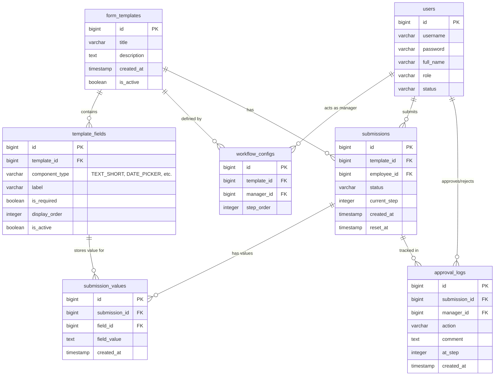

# Database Diagram

## Sơ đồ Mermaid

## Mô tả chi tiết các bảng

| Bảng | Mô tả |
| :--- | :--- |
| `users` | Lưu thông tin người dùng và vai trò (ADMIN, MANAGER, EMPLOYEE). |
| `form_templates` | Chứa thông tin về tiêu đề và mô tả của các loại đơn. |
| `template_fields` | Các trường nhập liệu thuộc về một form template. |
| `workflow_configs` | Cấu hình luồng phê duyệt (các bước duyệt và người duyệt tương ứng). |
| `submissions` | Thông tin chung của đơn đã nộp (người nộp, trạng thái, bước hiện tại). |
| `submission_values` | **(EAV Model)** Lưu dữ liệu thực tế cho từng trường của đơn nộp. |
| `approval_logs` | Lịch sử phê duyệt từng bước của các cấp quản lý. |
