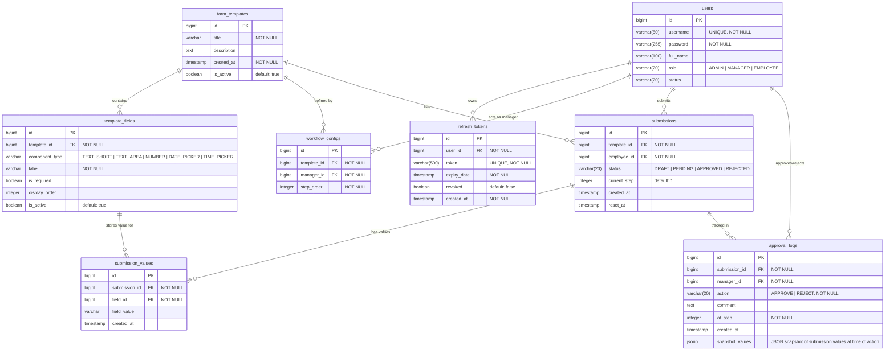

# Database Diagram

## Sơ đồ Mermaid

```mermaid
erDiagram
    users {
        bigint id PK
        varchar(50) username "UNIQUE, NOT NULL"
        varchar(255) password "NOT NULL"
        varchar(100) full_name
        varchar(20) role "ADMIN | MANAGER | EMPLOYEE"
        varchar(20) status
    }

    refresh_tokens {
        bigint id PK
        bigint user_id FK "NOT NULL"
        varchar(500) token "UNIQUE, NOT NULL"
        timestamp expiry_date "NOT NULL"
        boolean revoked "default: false"
        timestamp created_at "NOT NULL"
    }

    form_templates {
        bigint id PK
        varchar title "NOT NULL"
        text description
        timestamp created_at "NOT NULL"
        boolean is_active "default: true"
    }

    template_fields {
        bigint id PK
        bigint template_id FK "NOT NULL"
        varchar component_type "TEXT_SHORT | TEXT_AREA | NUMBER | DATE_PICKER | TIME_PICKER"
        varchar label "NOT NULL"
        boolean is_required
        integer display_order
        boolean is_active "default: true"
    }

    workflow_configs {
        bigint id PK
        bigint template_id FK "NOT NULL"
        bigint manager_id FK "NOT NULL"
        integer step_order "NOT NULL"
    }

    submissions {
        bigint id PK
        bigint template_id FK "NOT NULL"
        bigint employee_id FK "NOT NULL"
        varchar(20) status "DRAFT | PENDING | APPROVED | REJECTED"
        integer current_step "default: 1"
        timestamp created_at
        timestamp reset_at
    }

    submission_values {
        bigint id PK
        bigint submission_id FK "NOT NULL"
        bigint field_id FK "NOT NULL"
        varchar field_value
        timestamp created_at
    }

    approval_logs {
        bigint id PK
        bigint submission_id FK "NOT NULL"
        bigint manager_id FK "NOT NULL"
        varchar(20) action "APPROVE | REJECT, NOT NULL"
        text comment
        integer at_step "NOT NULL"
        timestamp created_at
        jsonb snapshot_values "JSON snapshot of submission values at time of action"
    }

    users ||--o{ refresh_tokens : "owns"
    form_templates ||--o{ template_fields : "contains"
    form_templates ||--o{ workflow_configs : "defined by"
    users ||--o{ workflow_configs : "acts as manager"
    form_templates ||--o{ submissions : "has"
    users ||--o{ submissions : "submits"
    submissions ||--o{ submission_values : "has values"
    template_fields ||--o{ submission_values : "stores value for"
    submissions ||--o{ approval_logs : "tracked in"
    users ||--o{ approval_logs : "approves/rejects"
```

## Mô tả chi tiết các bảng

| Bảng | Mô tả |
| :--- | :--- |
| `users` | Lưu thông tin người dùng và vai trò (`ADMIN`, `MANAGER`, `EMPLOYEE`). |
| `refresh_tokens` | Lưu refresh token JWT. Hỗ trợ one-time use, rotation và revocation (logout). Một user có thể có nhiều token (multi-device). |
| `form_templates` | Chứa thông tin về tiêu đề và mô tả của các loại đơn. |
| `template_fields` | Các trường nhập liệu thuộc về một form template, mỗi trường có `component_type` xác định kiểu UI. |
| `workflow_configs` | Cấu hình luồng phê duyệt: danh sách các bước (`step_order`) và manager phụ trách từng bước. |
| `submissions` | Thông tin chung của đơn đã nộp (người nộp, trạng thái, bước hiện tại). |
| `submission_values` | **(EAV Model)** Lưu dữ liệu thực tế cho từng trường của đơn nộp. |
| `approval_logs` | Lịch sử phê duyệt từng bước. Cột `snapshot_values` (JSONB) lưu snapshot toàn bộ dữ liệu đơn tại thời điểm manager thực hiện hành động, phục vụ xem lịch sử. |

## Ghi chú thiết kế

- **EAV (Entity-Attribute-Value)**: Bảng `submission_values` dùng mô hình EAV để lưu dữ liệu linh hoạt theo cấu trúc form động.
- **JSON Snapshot**: Cột `snapshot_values` trong `approval_logs` lưu dữ liệu dạng JSONB (PostgreSQL), giúp xem lại trạng thái đơn đúng tại thời điểm duyệt, ngay cả khi dữ liệu sau đó bị sửa đổi.
- **Refresh Token Rotation**: Mỗi lần refresh, token cũ bị revoke và token mới được cấp (`revoked = true`). Token hết hạn sau 7 ngày (configurable).
